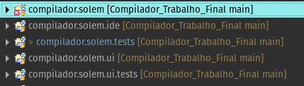
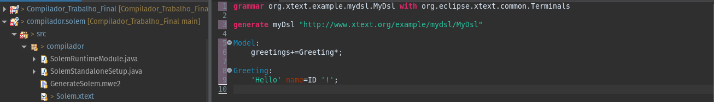
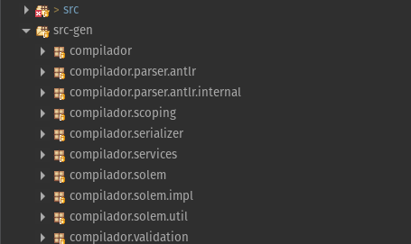

# Solem

Solem é uma linguagem que gera código java utilizando como base em sua estrutura Portugol.

## Ferramentas
- [Xtext](https://eclipse.dev/Xtext/), Framework utilizado para criação da grámatica e geração dos analisadores
- [Antlr](https://www.antlr.org/), utilizado em conjunto com o xtext para criação dos geradores
- [Java](https://www.java.com/pt-BR/), linguagem de programação gerada
- [Eclipse](https://eclipseide.org/), IDE para integração com o Xtext

## Criação do projeto
Após as ferramentas serem instaladas, podemos criar novo projeto no Ecplise em projeto Xtext em File → new → project → Xtext.

        - Deve se atentar nas versões java na hora da criação
A estrutura de arquivo deve conter a pasta com o nome do nosso projeto, ide, tests e ui, como abaixo:

A pasta principal do nosso projeto é a que contém o nosso arquivo .text, onde colocaremos nossa gramática. O arquivo .xtext pré configurado com terminais comuns, facilitando o processo de criação

Após a criação da grámatica, executamos nosso arquivo e geramos os artefatos xtext, onde se encontrarão: nosso analisador sintático, léxico, semantico e tokens.

Dentre os arquivos gerados, temos um Generator.xtend, colocaremos as regras para usar a nossa linguagem como uma geradora de código java.
Após isso podemos iniciar uma nova aplicação do Eclipse para testar nossa linguagem.